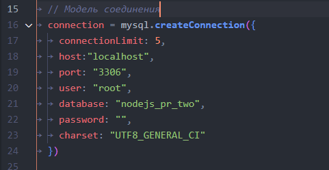
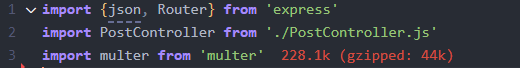
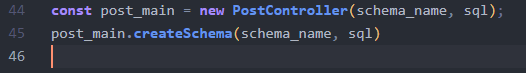
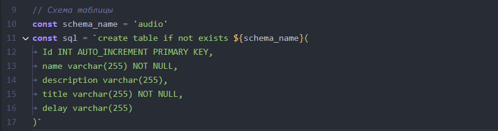
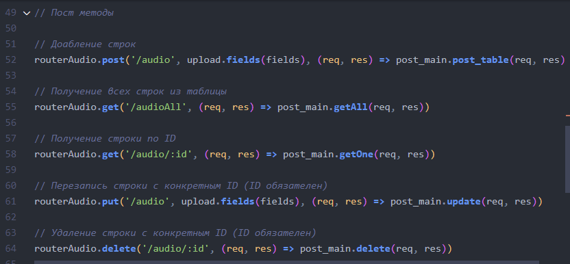
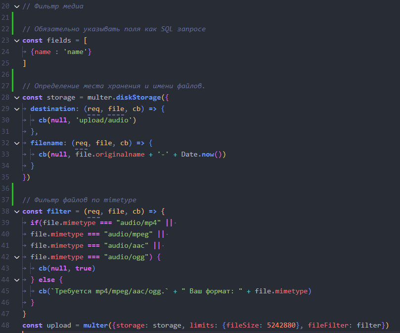

<!DOCTYPE html>
<html lang="en">
<head>
	<meta charset="UTF-8">
	<meta http-equiv="X-UA-Compatible" content="IE=edge">
	<meta name="viewport" content="width=device-width, initial-scale=1.0">
	<link rel="stylesheet" href="./src/app.css">
	<link rel="preconnect" href="https://fonts.googleapis.com"><link rel="preconnect" href="https://fonts.gstatic.com" crossorigin><link href="https://fonts.googleapis.com/css2?family=Raleway:wght@300;400;500;600;700&display=swap" rel="stylesheet">
</head>
<body>
<h1/>

</body>
</html>

## **RestAPI** - **MySQL** - **Express**
---
##### Привет! Это мой первый ResAPI на express с использованием MySQL, multer
> Контроллер максимально, на сколько смог мой мозг, переиспользуемый. 
---
#### Требуемые для работы зависимости в проекте: 
- ###### Express JS
- ###### Multer
- ###### Path
- ###### Fs
- ###### Flatted
- ###### mysql2
- ###### hbs

Главный файл, который вы можете использовать в своём проекте - **[PostController](./PostController.js)**
>> В самом контроллере оставлены комментарии по поводу его работы.
>> P.S. Не вините за мой говнокод, я начал изучать это дело около месяца назад 😘

Методы **post_table()** и **update()** умеют обрабатывать файлы и ошибки с ними вызываемые. Для фильтрации файлов из post запроса я использую методы **multer**, пример будет ниже.

---
| Метод\Поле | Использование |
|----------------|:---------:|
|	connect()| Подключения к БД |
|	createSchema(**schema_name, sql**)| Создания таблицы |
|post_table(**req, res**)| Добавление строки в таблицу|
|getAll(**req, res**)|  Получить все данные таблицы|
|getOne(**req, res**)|  Получить таблицу по *'ID'*, где *'ID'* берется из параметров запроса req.params*|
|update(**req, res**)| Обновить данные в строке по *'ID'*, где *'ID'*, берется из **body** запроса|
|delete(**req, res**)| Удалить строку по *'ID'*, где *'ID'*, берется из **body** запроса|

---
_В файле [RouterMain](./RouterMain.js) или [RouterAudio](./routerAudio.js) можно рассмотреть примеры использования._
> ---
> ### Модель соединения с БД описывается в контроллере.
> ## 
> ---

> ---
> # Router Main
> ## Нужные импорты
> ## 
> 
> Обязательно передать в параметры конструтора **имя схемы** и **sql запрос**
> При создании схемы это так же обязательно.
> ## 
> ## 
> ---
> ## Создаём запросы. 
> В параметры метода так же важно передать **(req, res)**  из колбэка.
> ## 
> ---
> ## Фильтрация файлов
> Использую **multer**, осуществляю в кадом Router.
> ## 

